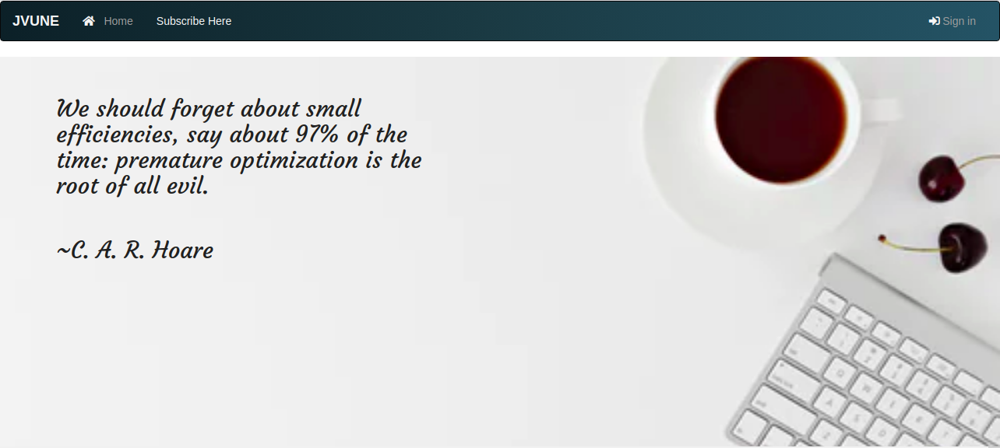

### JVUNE

# By Cecilia Barasa

## Description

This is a web application that allows users to post a blog, view, update and also delete the blog he/she has posted

## Preview

### User Stories
# As a user you are able to
* view the blog posts on the site
* comment on blog posts
* view the most recent posts
* receive an email alert when a new post is made by joining a subscription.
* see random quotes on the site
* sign in to the blog.
* create a blog from the application.
* delete comments that I find insulting or degrading.
* update or delete blogs I have created.

## BDD
| Behavior | Input | Output |
| -------- | -------- | -------- |
| Load the page    | On page load      | View Random Quotes and Signup     |
| Select SignUp     | Email,Username,Password   | Redirect to Login   |
| Select Login    | Username and password      | Redirect to Home page with recent blogs button and create blog    |
| Create a blog post by filling blog form     | Write your blog and post it to blogs  | Your blog is displayed in blogs page   |
| User comment on the Blog post plus a nickname    | Write your feedback and post it      | Your feedback is displayed under the blog post     |
| Writer delete a blog post     | Deleting the blog post from the database   | The blog post will be deleted and not appear on the page   |
 Writer update a blog post    | Updating the blog post in database      | The blog post will be updated     |
| Writer delete a comment     | Deleting the blog comment in database   | The comment will no longer appear under the post   |

## Technologies Used
* `Python3.6`
* `Flask`
* `HTML`
* `CSS`
* `MAKO`
* `C`
* `JAVASCRIPT`

### 

## [Support and contact details](https://www.linkedin.com/in/cecilia-barasa-4a8311195/)

